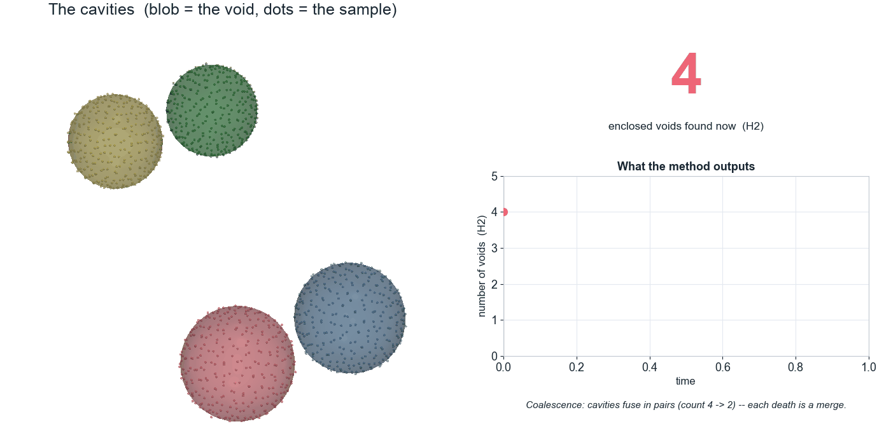
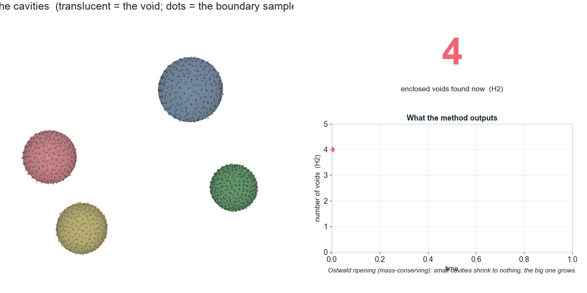
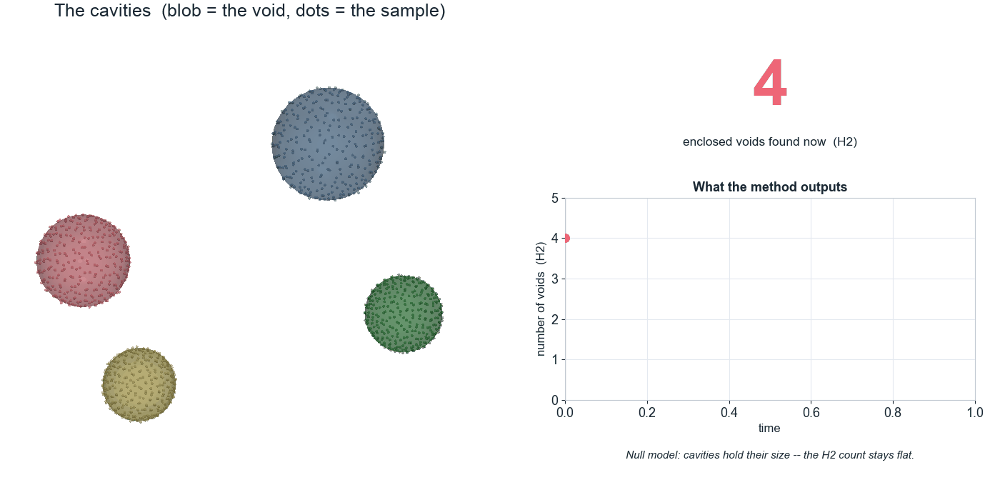
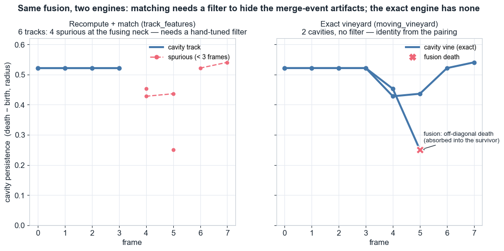

# chromatic-cells

Application- and paper-specific work built on the general **`vineyards`** engine —
kept out of that repo so it stays focused on general vineyard functionality.
Two threads live here:

1. **Void / lumen coarsening** (`chromatic_cells/`, `examples/`) — synthetic void
   scenarios with known ground truth, and the cavity genealogy that reads fusion
   vs resorption off the exact vineyard, toward lumen coarsening and pumping-rate
   inference.
2. **Kinetic chromatic vineyard** (`theory/`) — the dynamic chromatic 6-pack with
   vine identity, toward cell segregation (zebrafish germ-layer sorting).

The broadly-applicable engine — moving/kinetic vineyards, weighted (regular /
Laguerre) alpha, the chromatic 6-pack, `assert_no_hidden` — lives in the
`vineyards` repo. Install it in the same environment:

```bash
pip install -e ../vineyards          # the engine
pip install -e .                     # this package (add [demo] for the animations)
```

Remote: `git@github.com:codingwithshawnyt/chromatic-cells.git`.

## Void / lumen coarsening

An enclosed cavity — a *lumen*, a void — is an **H2 hole**: sample points on its
boundary and the alpha complex has a 2-dimensional class whose persistence (death
value) is the cavity's radius. `chromatic_cells.synthetic` builds controllable
scenarios where the void history is known by construction — **coalescence**
(cavities fuse), **Ostwald ripening** (small cavities dissolve, mass-conserving),
and a **null** control — so a topological pipeline can be checked against ground
truth (`tests/test_synthetic.py`).

### Watch the cavities change, watch the count respond

Each scene is a side-by-side animation: **left**, the cavities (translucent blob =
the void, dots = the boundary sample); **right**, the method's output — the number
of enclosed voids (H2) drawn over time, stepping down the instant a blob merges or
vanishes. Ripening's count falls 4 → 2 while the null model stays flat — the method
tells them apart; coalescence also goes 4 → 2 but by a visibly different process.

| Coalescence | Ostwald ripening | Null |
|:---:|:---:|:---:|
|  |  |  |

The filtration step (grow balls until a hole/void is born, then fills — one
barcode bar) and the genus contrast (H1, not H2) are in
`examples/pipeline_explainer.py` and `examples/void_demo.py`.

### Cavity genealogy: fusion vs resorption from the exact pairing

`chromatic_cells.genealogy` reads, off the exact `moving_vineyard`, HOW each cavity
dies: **resorption** (the vine slides to the diagonal) vs **fusion** (an
off-diagonal vine death — possible only through a flip, so invisible to a
fixed-complex vineyard or a matching heuristic). `coalescence_fraction` = merges /
(merges + resorptions), the readout that by Le Verge-Serandour & Turlier (2021)
constrains the active ion-pumping rate of a coarsening embryo.



**The merge partner, from the pairing's geometry (the advance) — and what's still
open.** Fusion-vs-resorption fate is exact from the pairing (validated on the
two-lumen regimes, fusion → 1.0, resorption → 0.0). The harder question — *which*
cavity absorbed which, when there is more than one survivor — is answered not by
volume (a survivor's radius doesn't grow through a merge, so `died_radius³` has no
signal) but by **location**: each H2 vine's *destroyer* is the tetrahedron that
fills the cavity, and `moving_vineyard` exposes it per frame
(`Vine.destroyer_frames`), so its centroid localises the cavity in space — the
geometry the (birth, death) diagram discards. The absorbed cavity's partner is the
surviving cavity **nearest to where it died**. On the adversarial
`two_pair_coalescence` (two coalescence pairs, all four cavities the same size so
volume *cannot* choose) the partners come out correct — each fusion pairs **within
its own pair, not across**
(`test_partner_choice_survives_the_adversarial_multi_cavity_case`). **The partner
signal is solved.** What is *not* yet robust is the fragmentation *cleanup*: the
survivor's vine still fragments, and the heuristics that re-link fragments and drop
co-located artifacts are parameter-sensitive — a sweep is clean at n_each ≥ 22 and
≤ 6 frames but over-/under-counts at coarser sampling or more frames. So a
fragmentation cleanup robust across all sampling remains open. `examples/blastocyst.py`
is the cell-data pipeline (centroids + radii → weighted vineyard → genealogy →
coalescence fraction); real data plugs into it unchanged.

### Real embryo data (BlastoSPIM)

`chromatic_cells.imaging` / `examples/blastospim.py` ingest **labeled segmentation
masks** — the format of the public **BlastoSPIM** light-sheet dataset (Nunley,
Posfai, Shvartsman, Brown; blastospim.flatironinstitute.org): per-frame 3D nucleus
masks → cell centroids (`center_of_mass`) + radii (voxel count → equivalent-sphere)
→ weighted `moving_vineyard` → genealogy. No GPU segmentation needed; run
`python examples/blastospim.py /path/to/series` (or with no argument for a
synthetic-mask self-test). Two honest caveats it enforces/states: (1) `moving_vineyard`
needs the **same cell in row *i* every frame** — the vineyard supplies *vine*
identity, not *cell* correspondence, so pass BlastoSPIM's lineage tracking or use
the built-in nearest-centroid fallback over a **division-free** window (cell
division changes the count and is rejected); (2) this validates **the engine on
real embryo geometry**, not yet the pumping-rate biology, which needs
lumen-resolved, ion-perturbed imaging (Turlier / Maître). Persistence tolerances
are scale-invariant (resorption is judged relative to each cavity's own peak) and
the geometry is normalized to the mean cell radius, so voxel/micron data works.

## theory/

The kinetic-chromatic paper's theoretical spine (drafts — proofs argued, careful
steps flagged for formal completion; geometry/empirics verified in the engine's
test suite):

- **`flip-handoff.md`** — the chromatic flip-handoff theorem: at a generic
  bistellar flip in the lifted chromatic Delaunay, dying and arriving simplices
  share the empty-stack radius. Every generic flip proved (interior and hull, the
  latter via one-point compactification); only coincident/degenerate
  cosphericities are deferred (SoS corollary). (Empirically certified in
  `vineyards/tests/test_chromatic_handoff.py`.)
- **`transposition-update.md`** — the transposition update rules for the 6-pack:
  how an adjacent transposition propagates through the six interlinked reductions;
  the locality lemma (`O(1)` dirty columns) and the CEM06-style update. Implemented
  and gated (`IncrementalChromaticSixPack`).
- **`complexity.md`** — the per-transposition cost bound: `O(1)` amortised
  (≤ 6× CEM06); measured ≈ 65× fewer column ops than the re-reduce regime, flat
  in `n`.

## Status

SoS-free chromatic engine pieces are built and gated in the `vineyards` repo (the
static 6-pack + simplex-level pairing bit-exact vs `chromatic_tda`, the dynamic
6-pack through transpositions, the flip-handoff certified for bistellar flips, and
the `O(1)`-amortised per-transposition update). The flip-handoff is proved for the
generic flip. Open paper work: the complexity write-up, 6-pack vine-identity
tracking, and the clean multi-lumen cavity genealogy. SoS (degenerate flips) is
the deferred Edelsbrunner item.

Research code from a summer internship project at ISTA (group of
Herbert Edelsbrunner), June–July 2026.
